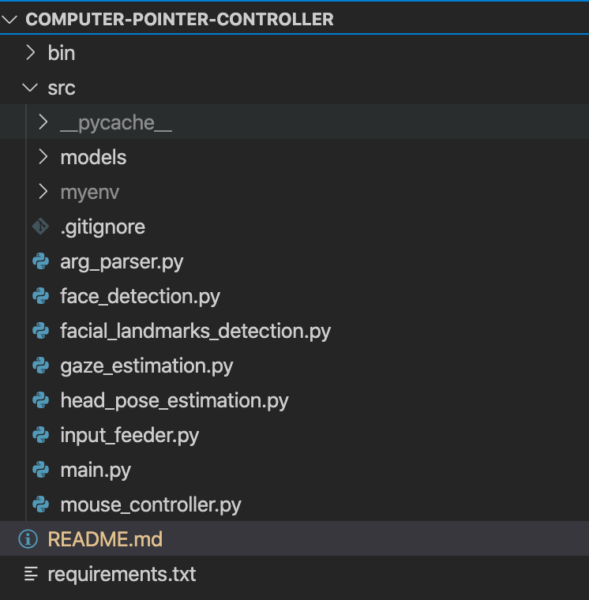
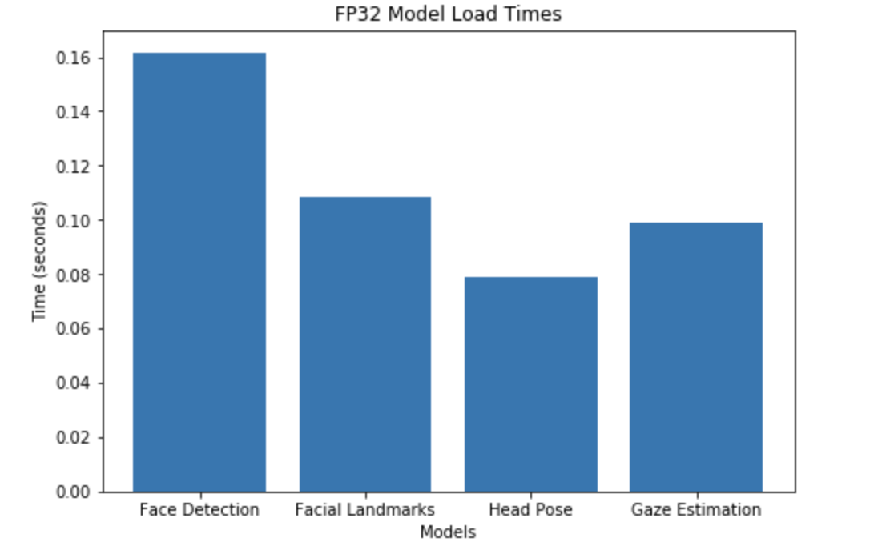
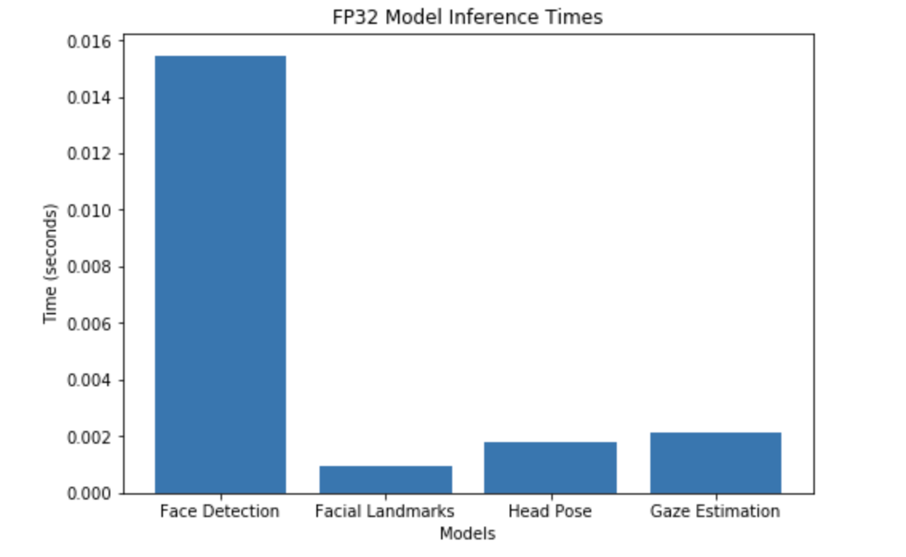
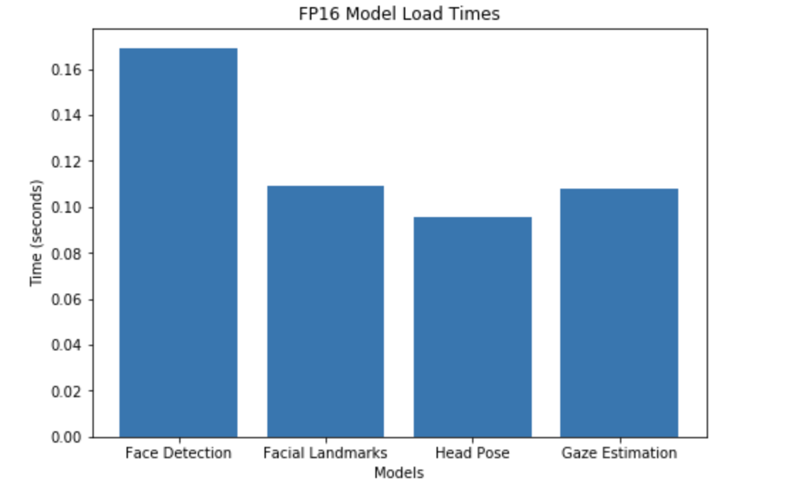
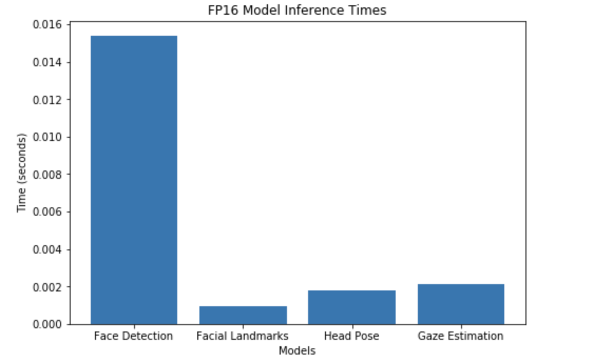
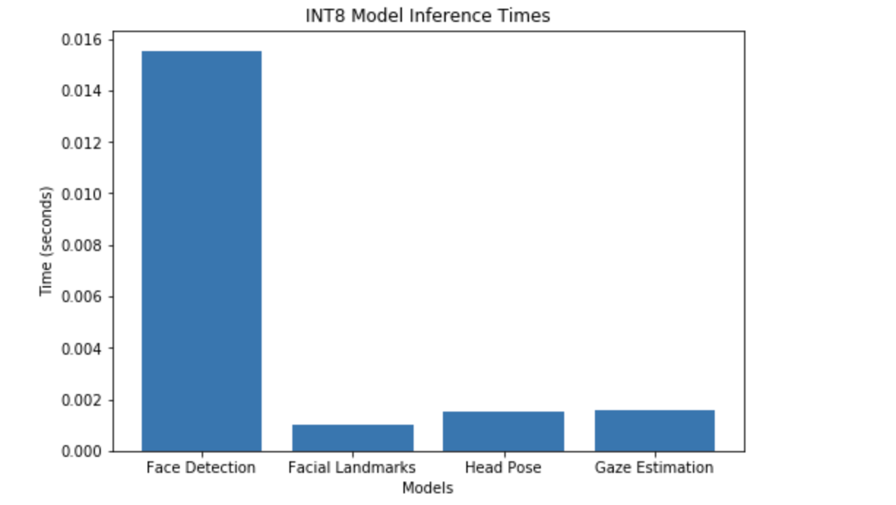
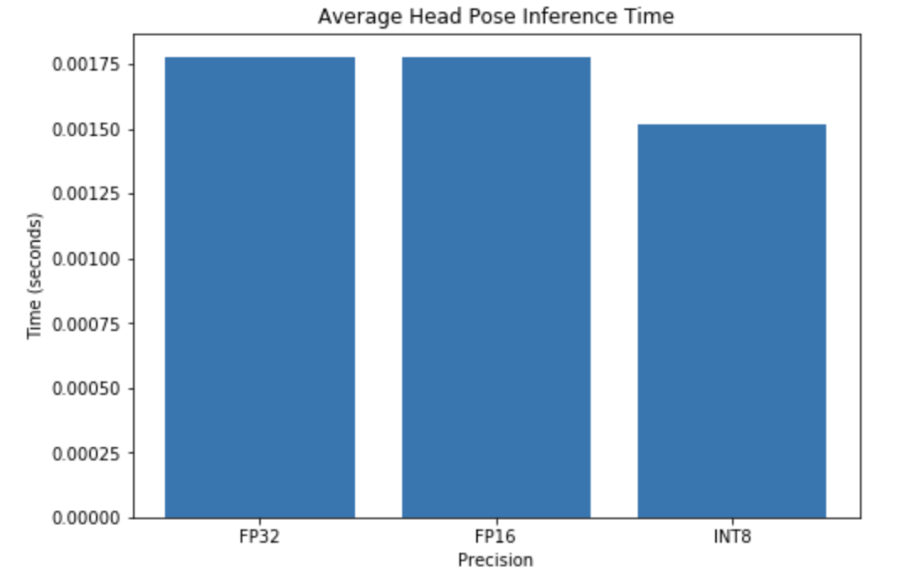
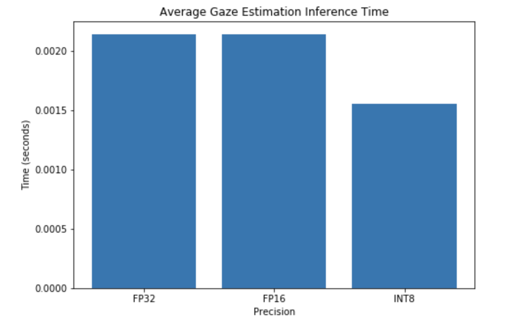

# Computer Pointer Controller

This project was designed to allow a user to control the movement of their computers mouse pointer using their head position and gaze. The project uses the [Gaze Estimation](https://docs.openvinotoolkit.org/latest/omz_models_intel_gaze_estimation_adas_0002_description_gaze_estimation_adas_0002.html) model, among a number of other models, to estimate the gaze of the user's eyes and change the mouse pointer position accordingly.

It also uses the InferenceEngine API from Intel's OpenVino ToolKit to run inference on models.

The application coordinates the flow of data from its input, and then amongst the different models used and then finally to the mouse controller, as can be seen in the image below. 


The application also allows for multiple forms of input. A user can specify a video file they want to use as input or if they don't specify any input the application will try to use input from the devices camera.

## Project Set Up and Installation

### Step 1. Install and configure OpenVINO
This project uses the OpenVINO toolkit. You will need to install it and set it up correctly to run the application. To do this you can follow the instructions [here](https://docs.openvinotoolkit.org/latest/index.html) and you can [download OpenVino here](https://software.intel.com/en-us/openvino-toolkit/choose-download).

Note: This project was developed using OpenVINO version 2020.4.287

### Step 2. Clone this Repository
Clone this repository onto your device by going [here](https://github.com/MichaelDalton7/computer-pointer-controller) and using either SSH or downloading a zip of the repository. If you download the zipped repository then unzip it into a directory that is easily accessible from the terminal for convenience.

Once the repository has been downloaded, open a terminal and cd into its base directory.

The downloaded repository should have a similar structure to the image below minus the directories "pychache" and "myenv" which will be added in laters steps



The "src" directory contains all the python files that the application uses. To start the application you will need to run the file [main.py](./src/main.py) in this directory. 

The OpenVino models are stored in the "src/models" directory and a demo video that can be used for the applications input can be found in the "bin" directory.

### Step 3. Create a Python Virtual Environment

Next you will need to create a virtual envrironment. You can do this with the below command:

```
python3 -m venv {ENVIRONMENT_NAME}
```

Once your virtual environment has been created activate it by running the command below:

```
source {ENVIRONMENT_NAME}/bin/activate
```

### Step 4. Install the projects dependencies in the virtual environment

Once you have activated your virtual environment you will need to install all of the projects dependencies on this environment to run the application. 

To do this, first you need to open the projects base directory in your terminal. This directory should contain a file called "requirements.txt". When you have opened this directory in your terminal run the command below:

```
pip3 install -r requirements.txt
```

Wait for all the dependencies to install and then move onto the next step.

### Step 5. Download the OpenVino Zoo Models

Next you will need to download the 4 models required to run the application. 

 - [Face Detection Model](https://docs.openvinotoolkit.org/latest/omz_models_intel_face_detection_adas_binary_0001_description_face_detection_adas_binary_0001.html)
- [Facial Landmark Detection Model](https://docs.openvinotoolkit.org/latest/omz_models_intel_landmarks_regression_retail_0009_description_landmarks_regression_retail_0009.html)
- [Head Pose Estimation Model](https://docs.openvinotoolkit.org/latest/omz_models_intel_head_pose_estimation_adas_0001_description_head_pose_estimation_adas_0001.html)
- [Gaze Estimation Model](https://docs.openvinotoolkit.org/latest/omz_models_intel_gaze_estimation_adas_0002_description_gaze_estimation_adas_0002.html)

From the base directory you will need to cd into the "models" directory using the command

```
cd src/models/
```

Assuming you have installed OpenVino into your devices "/opt" directory you can run the below commands to install each model.

Face Detection Model:
```
python3 /opt/intel/openvino/deployment_tools/open_model_zoo/tools/downloader/downloader.py --name face-detection-adas-binary-0001  
```

Facial Landmark Detection Model:
```
python3 /opt/intel/openvino/deployment_tools/open_model_zoo/tools/downloader/downloader.py --name landmarks-regression-retail-0009
```

Head Pose Estimation Model:
```
python3 /opt/intel/openvino/deployment_tools/open_model_zoo/tools/downloader/downloader.py --name head-pose-estimation-adas-0001 
```

Gaze Estimation Model:
```
python3 /opt/intel/openvino/deployment_tools/open_model_zoo/tools/downloader/downloader.py --name gaze-estimation-adas-0002 
```

## Demo
Once you have successfully setup the project you will be able to run the application on a demo video by using the commands below.

Firstly from the projects base directory, in your terminal, cd into the src directory using the command

```
cd src/
```

Next you need to ensure OpenVino has been sourced in your terminal using the command:

```
source /opt/intel/openvino/bin/setupvars.sh
```

Note: you will need to run this command everytime you open a new terminal

Assuming you have downloaded the OpenVino models into the projects "models" directory, installed the applications dependencies onto your virtual environment and sourced OpenVino in your terminal, then you can the run the command below to start the application

```
python main.py -i ../bin/demo.mp4
```

If you want to run the application using input from your devices camera you can use the command:

```
python main.py
```

Note: if you want to manually specify the model directories through command line arguments, then enter the models path, including the file name, but leave out the file extension e.g.
```
--gaze-estimation-model ./models/intel/gaze-estimation-adas-0002/FP32/gaze-estimation-adas-0002
```

The above command line argument will get the application to search for the gaze estimation model in the __./models/intel/gaze-estimation-adas-0002/FP32/__ directory. The application expects to find the files __gaze-estimation-adas-0002.bin__ and __gaze-estimation-adas-0002.xml__ in this directory

## Documentation

The application supports a number of command line arguments, all of which can be seen below.

```
Optional arguments:
  -i or --input

      The path to the input video file. If no input file
      path is specified then the application will try to use
      the video camera.

  -fm or --face-detection-model
  
      The path to the face detection model and it's weights
      file (.xml and .bin files). This path should include
      the model name but not the file extension

  -flm or --facial-landmark-detection-model

      The path to the facial landmark detection model and
      it's weights file (.xml and .bin files). This path
      should include the model name but not the file
      extension

  -gm or --gaze-estimation-model

      The path to the gaze estimation model and it's weights
      file (.xml and .bin files). This path should include
      the model name but not the file extension

  -hpm or --head-pose-estimation-model

      The path to the head pose estimation model and it's
      weights file (.xml and .bin files). This path should
      include the model name but not the file extension

  -d or --device

      The device type that inference should be run on. If
      not value is specifed the CPU will be used.

  -pr or --probability-threshold

      The probability threshold to be used to separate
      inference results that are correct from the ones that
      are incorrect. This should be a floating point value
      between 0 and 1. The default value is 0.6

  -ext or --extensions

      A path to an extension to be used by OpenVino

  -mui or --mouse-update-interval

      The number of frames between each mouse update. 
      The default value is 5.

  --show-detected-face

      Show a visual representation of the output from 
      the face detection model.

  --show-facial-landmarks

      Show a visual representation of the output from 
      the facial landmarks detection model.

  --show-head-pose SHOW_HEAD_POSE

      Show a visual representation of the output from 
      the head pose estimation model.

  --show-gaze-estimation SHOW_GAZE_ESTIMATION

      Show a visual representation of the output from 
      the gaze estimation model.

```

### Output Visualisation Command Line Arguments

If you want to see a visual representation of the output from each model you can use the command line arguments below when running the application.

Face Detection Model
```
 --show-detected-face True
```

Facial Landmarks Model
```
--show-facial-landmarks True
```

Head Pose Estimation Model
```
--show-head-pose True
```

Gaze Estimation Model
```
--show-gaze-estimation True
```

Note: Each of these arguments will open a new window and display the output of their associated model

## Benchmarks

The benchmark tests were performed on a Macbook Pro 2017 model which was equipped with

- Intel Core i7 2.8 GHz Quad-Core 
- 16 GB Ram

Tests were performed on the model precisions FP32, FP16 and INT8

The logs for the benchmark tests can be found in the file 
[benchmark_tests.log](./src/benchmark_tests.log)

The tests used the video file [./bin/demo.mp4](./bin/demo.mp4) for input.

## Results

### FP32 Results

Face Detection model load time: 0.16178107261657715 seconds

Facial Landmarks Detection model load time: 0.10812187194824219 seconds

Head Pose Estimation model load time: 0.07876825332641602 seconds

Gaze Estimation model load time: 0.09879016876220703 seconds



Average face detection inference time: 0.015469417733661199 seconds

Average facial landmark detection inference time: 0.0009390257172665354 seconds

Average head pose estimation inference time: 0.0017791804620775125 
seconds

Average gaze estimation inference time: 0.002139071286734888 seconds



Average total inference time: 0.020326695199740136 seconds

### FP16 Results

Face Detection model load time: 0.16927480697631836 seconds

Facial Landmarks Detection model load time: 0.10882282257080078 seconds

Head Pose Estimation model load time: 0.09541606903076172 seconds

Gaze Estimation model load time: 0.10789990425109863 seconds



Average face detection inference time: 0.015405545800419177 seconds

Average facial landmark detection inference time: 0.0009484897225590076 seconds

Average head pose estimation inference time: 0.0017729088411492816 seconds

Average gaze estimation inference time: 0.00214411040483895 seconds



Average total inference time: 0.020271054768966415 seconds

### INT8 Results

Face Detection model load time: 0.15818381309509277 seconds

Facial Landmarks Detection model load time: 0.14136004447937012 seconds

Head Pose Estimation model load time 0.16801810264587402 seconds

Gaze Estimation model load time: 0.21371102333068848 seconds


Average face detection inference time: 0.01554843530816547 seconds

Average facial landmark detection inference time: 0.0009852142657263805 seconds

Average head pose estimation inference time: 0.0015183545775332692 seconds

Average gaze estimation inference time: 0.0015528444516456734 seconds



Average total inference time: 0.019604848603070792 seconds

### Conclusion 
It can be seen from the results that one of the main issues with the application is that it is being slowed down by the inference speed of the face detection model. This model also only came with FP32 precision so we couldn't sacrifice accuracy for speed here by dropping down precision. 
This is disappointing as we seen we could speed up inference on the Head Pose Estimation and the Gaze Estimation models by dropping the precision of the models we used.





In the future, to improve the applications overall performance, I would try to find a better face detection model.

I also found, at least for the demo video, that running the application on lower precision models such as FP16 or INT8, didn't affect the accuracy of the application all that much. This means we can run the application with FP16 models on GPUs and hardware accelerators like VPUs without worrying about an excessive loss in accuracy.

