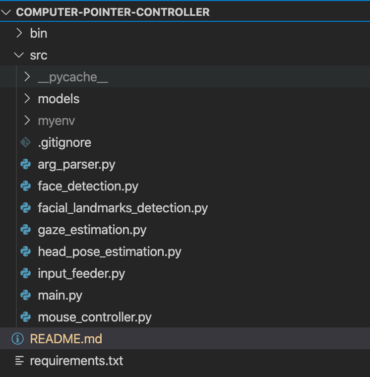

# Computer Pointer Controller

*TODO:* Write a short introduction to your project

## Project Set Up and Installation

### Step 1. Install and configure OpenVINO
This project uses the OpenVINO toolkit. You will need to install and set it up correctly to run the application. To do this you can follow the instructions [here](https://docs.openvinotoolkit.org/latest/index.html) and you can [download OpenVino here](https://software.intel.com/en-us/openvino-toolkit/choose-download).

Note: This project was developed using OpenVINO version 2020.4.287

### Step 2. Clone this Repository
Clone this repository onto your device by going [here](https://github.com/MichaelDalton7/computer-pointer-controller) and using either SSH or downloading a zip of the repository. If you download the zipped repository then unzip it into a directory that is easily accessible from the terminal for convenience.

Once the repository has been downloaded, open a terminal and cd into its base directory.

The downloaded repository should have a similar structure to the image below minus the directories "pychache" and "myenv" which will be added in laters steps



### Step 3. Create a Python Virtual Environment

Next you will need to create a virtual envrironment. You can do this with the below command:

```
python3 -m venv {ENVIRONMENT_NAME}
```

Once your virtual environment is created activate by running the command below:

```
source {ENVIRONMENT_NAME}/bin/activate
```

### Step 4. Install the projects dependencies on the virtual environment

Once you have activated your virtual environment you will need to install all of the projects dependencies on this environment to run the application. 

To do this first you need to open the projects base directory in your terminal. This directory should contain a file call "requirements.txt". When you have opened this directory in your terminal run the command below:

```
pip3 install -r requirements.txt
```

Wait for all the dependencies to install and then move onto the next step.

### Step 5. Download the OpenVino Zoo Models

Next you need to download the 4 models required to run the application. 

 - [Face Detection Model](https://docs.openvinotoolkit.org/latest/omz_models_intel_face_detection_adas_binary_0001_description_face_detection_adas_binary_0001.html)
- [Facial Landmark Detection Model](https://docs.openvinotoolkit.org/latest/omz_models_intel_landmarks_regression_retail_0009_description_landmarks_regression_retail_0009.html)
- [Head Pose Estimation Model](https://docs.openvinotoolkit.org/latest/omz_models_intel_head_pose_estimation_adas_0001_description_head_pose_estimation_adas_0001.html)
- [Gaze Estimation Model](https://docs.openvinotoolkit.org/latest/omz_models_intel_gaze_estimation_adas_0002_description_gaze_estimation_adas_0002.html)

From the base directory you will need to cd into the "models" directory using the command

```
cd src/models/
```

Assuming you have installed OpenVino into your devices "/opt" directory you can run the below commands to install each model.

Face Detection Model:
```
python3 /opt/intel/openvino/deployment_tools/open_model_zoo/tools/downloader/downloader.py --name face-detection-adas-binary-0001  
```

Facial Landmark Detection Model:
```
python3 /opt/intel/openvino/deployment_tools/open_model_zoo/tools/downloader/downloader.py --name landmarks-regression-retail-0009
```

Head Pose Estimation Model:
```
python3 /opt/intel/openvino/deployment_tools/open_model_zoo/tools/downloader/downloader.py --name head-pose-estimation-adas-0001 
```

Gaze Estimation Model:
```
python3 /opt/intel/openvino/deployment_tools/open_model_zoo/tools/downloader/downloader.py --name gaze-estimation-adas-0002 
```

## Demo
Once you have successfully setup the project you will be able to run the application on a demo video by using the commands below.

Firstly from the projects base directory cd into the src directory using the command

```
cd src/
```

Assuming you have downloaded the OpenVino models into the project using the commands above you can the run the command below to start the application

```
python main.py -fm ./models/intel/face-detection-adas-binary-0001/FP32-INT1/face-detection-adas-binary-0001 -flm ./models/intel/landmarks-regression-retail-0009/FP32/landmarks-regression-retail-0009 -gm ./models/intel/gaze-estimation-adas-0002/FP32/gaze-estimation-adas-0002 -hpm ./models/intel/head-pose-estimation-adas-0001/FP32/head-pose-estimation-adas-0001 --input ../bin/demo.mp4
```

If you want to run the application using input from your devices camera you can use the command:

```
python main.py -fm ./models/intel/face-detection-adas-binary-0001/FP32-INT1/face-detection-adas-binary-0001 -flm ./models/intel/landmarks-regression-retail-0009/FP32/landmarks-regression-retail-0009 -gm ./models/intel/gaze-estimation-adas-0002/FP32/gaze-estimation-adas-0002 -hpm ./models/intel/head-pose-estimation-adas-0001/FP32/head-pose-estimation-adas-0001
```

## Documentation
*TODO:* Include any documentation that users might need to better understand your project code. For instance, this is a good place to explain the command line arguments that your project supports.

```
Required arguments:
  -fm or --face-detection-model
  
      The path to the face detection model and it's weights
      file (.xml and .bin files). This path should include
      the model name but not the file extension

  -flm or --facial-landmark-detection-model

      The path to the facial landmark detection model and
      it's weights file (.xml and .bin files). This path
      should include the model name but not the file
      extension

  -gm or --gaze-estimation-model

      The path to the gaze estimation model and it's weights
      file (.xml and .bin files). This path should include
      the model name but not the file extension

  -hpm or --head-pose-estimation-model

      The path to the head pose estimation model and it's
      weights file (.xml and .bin files). This path should
      include the model name but not the file extension


Optional arguments:
  -i or --input

      The path to the input video file. If no input file
      path is specified then the application will try to use
      the video camera.

  -d or --device

      The device type that inference should be run on. If
      not value is specifed the CPU will be used.

  -pr or --probability-threshold

      The probability threshold to be used to separate
      inference results that are correct from the ones that
      are incorrect. This should be a floating point value
      between 0 and 1. The default value is 0.6

  -ext or --extensions

      A path to an extension to be used by OpenVino

  -mui or --mouse-update-interval

      The number of frames between each mouse update. The
      default value is 5.

  --show-detected-face

      Show a visual representation of the output from the
      face detection model.

  --show-facial-landmarks

      Show a visual representation of the output from the
      facial landmarks detection model.

  --show-head-pose SHOW_HEAD_POSE

      Show a visual representation of the output from the
      head pose estimation model.

  --show-gaze-estimation SHOW_GAZE_ESTIMATION

      Show a visual representation of the output from the
      gaze estimation model.

```

## Benchmarks
*TODO:* Include the benchmark results of running your model on multiple hardwares and multiple model precisions. Your benchmarks can include: model loading time, input/output processing time, model inference time etc.

## Results
*TODO:* Discuss the benchmark results and explain why you are getting the results you are getting. For instance, explain why there is difference in inference time for FP32, FP16 and INT8 models.
